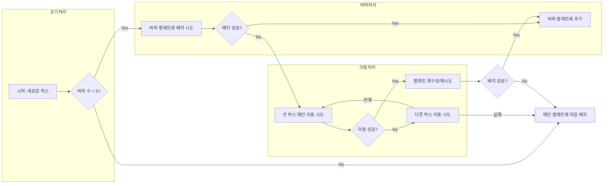

```mermaid
flowchart LR
    subgraph 초기처리
    A[시작: 새로운 박스] --> B{버퍼 수 < 5?}
    end
    
    subgraph 버퍼처리
    C[버퍼 팔레트에 배치 시도] --> D{배치 성공?}
    D -->|Yes| E[버퍼 팔레트에 추가]
    end
    
    subgraph 이동처리
    F[큰 박스 메인 이동 시도] --> G{이동 성공?}
    G -->|Yes| H[팔레트 재구성/재시도]
    G -->|No| I[다른 박스 이동 시도]
    I -->|반복| F
    end
    
    B -->|Yes| C
    B -->|No| J[메인 팔레트에 직접 배치]
    D -->|No| F
    I -->|실패| J
    H --> K{배치 성공?}
    K -->|Yes| E
    K -->|No| J
```